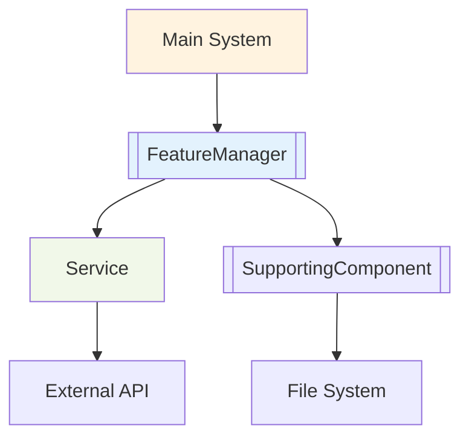

# 🤖 Feature/Product PRD Template

This template provides a proven structure for writing Product Requirements Documents (PRDs) for features or products. Use this template to ensure consistency, completeness, and clear implementation guidance for any initiative.

## 📋 PRD Template Structure

```markdown
---
lastUpdated: "[YYYY-MM-DD]"
title: "[Feature or Product Name]"
documentType: "Product Requirements Document"
version: "1.0"
status: "Draft"
priority: "High|Medium|Low"
implementationDate: "[YYYY-MM-DD when completed]"
---

# [Feature or Product Name] - Product Requirements Document

## Executive Summary

[2-3 paragraphs describing:]
- Clear definition of what this feature/product does
- Primary value proposition and target users (e.g., developers, end-users, business teams)
- Key capabilities this feature/product enables
- Relationship to existing or planned features (builds on, enables, depends on)

**Context**: [Explain how this feature/product enhances the system's capabilities, user experience, or business value.]

**Related Features/PRDs**:
- **Depends On**: [List any features/PRDs this requires]
- **Enables**: [List features/PRDs this makes possible]
- **Builds Foundation For**: [List future features/PRDs this supports]
- **Implementation Sequence**: [Reference to implementation plan or roadmap]

## Independent Value Proposition

[Describe the standalone value this feature/product provides, even without other features:]
- **Immediate Benefits**: [What users get right away]
- **Performance/Efficiency Gains**: [Quantifiable improvements where possible]
- **User Experience Improvements**: [How this makes the feature/product better to use]
- **Team/Business Benefits**: [Productivity or workflow improvements]

**Standalone Implementation**: [Confirm this PRD can be fully implemented independently, providing immediate value]

## ✅ Implementation Status

**Status**: 🚧 **[Draft|In Progress|Testing|Completed]**

[When implemented, include:]
**Key Achievements**:
- ✅ [Major feature implemented]
- ✅ [Performance target achieved]
- ✅ [Integration completed]
- ✅ [Testing milestone]

**Implementation Details**: See [Implementation Plan Reference]

**Performance Results**: [Actual metrics achieved vs targets]

## Problem Statement

### Current Challenges

[List 3-5 specific problems this feature/product solves:]

1. **[Problem Category]**: [Specific challenge with processing, user interaction, or automation]
   - **Impact**: [How this affects users or system performance]
   - **Current Workaround**: [What users do now, if anything]

2. **[Problem Category]**: [Another challenge]
   - **Impact**: [Business or technical impact]
   - **Current Workaround**: [Existing solutions and their limitations]

[Continue for 3-5 key problems...]

### Business Impact

- **[Impact Category]**: [Specific business benefit this solves]
- **[Impact Category]**: [Another measurable improvement]
- **[Impact Category]**: [User experience or efficiency gain]
- **[Impact Category]**: [Productivity or capability enhancement]

## Solution Overview

### Core Concept

[2-3 sentences describing the high-level approach to solving the identified problems:]

**Key Enhancements**:
- **[Enhancement Type]**: [How this improves processing or decision-making]
- **[Enhancement Type]**: [User interaction or automation improvement]
- **[Enhancement Type]**: [Performance or accuracy improvement]

### System Integration

[If applicable, describe system/component requirements:]
- **Component Types**: [Which systems/components this feature/product requires]
- **Configuration**: [Any specific configuration requirements or strategies]
- **Context Management**: [How this feature/product handles context and memory]
- **Fallback Behavior**: [What happens when services or components are unavailable]

## Functional Requirements

### FR-1: [Primary Functional Requirement]
**Priority**: High
**Description**: [Clear description of the core functionality this requirement provides]

#### Processing Requirements
- [ ] [Specific integration requirement]
- [ ] [Template or strategy requirement]
- [ ] [Response validation requirement]
- [ ] [Context management requirement]

#### Acceptance Criteria
- [ ] [Specific, testable criteria for success]
- [ ] [Performance benchmark (e.g., response time, accuracy)]
- [ ] [Error handling requirement]
- [ ] [Integration requirement with existing workflow]
- [ ] [User feedback or logging requirement]

### FR-2: [Secondary Functional Requirement]
**Priority**: High|Medium
**Description**: [Description of additional functionality]

#### Processing Requirements
- [ ] [Technical requirements]
- [ ] [Selection or configuration requirements]
- [ ] [Quality assurance requirements for output]

#### Acceptance Criteria
- [ ] [Testable success criteria]
- [ ] [Performance or accuracy targets]
- [ ] [Edge case handling]
- [ ] [Backwards compatibility requirements]

### FR-3: [Additional Requirement]
**Priority**: Medium
**Description**: [Description of supporting functionality]

#### Acceptance Criteria
- [ ] [Success criteria]
- [ ] [Integration requirements]
- [ ] [Configuration requirements]

[Continue with additional FRs as needed...]

## Technical Architecture

### Integration Points

**Core Integration**:
- **Main Integration**: [How this feature/product integrates with the main system or application]
- **CLI/API Integration**: [New commands, endpoints, or options required]
- **Configuration**: [New configuration options for relevant config files]

**Service Integration**:
- **Service Requirements**: [Which service methods this feature/product uses]
- **Templates**: [New templates or modifications needed]
- **Component Requirements**: [Specific component capabilities needed]
- **Context Management**: [How this feature/product manages context]

### Data Structures

**New Interfaces/Types Needed**:
```typescript
// Example interfaces - customize for your feature/product
interface [FeatureConfig] {
  [configOption]: boolean;
  [anotherOption]: string;
}

interface [FeatureResult] {
  [resultProperty]: string;
  success: boolean;
  metadata: [FeatureMetadata];
}
```

### Component Architecture

**New Classes/Components**:

- **[FeatureManager]**: [Primary orchestration class]
- **[SupportingProcessor]**: [Processing or data handling component]
- **[OtherComponent]**: [Additional components needed]

**Integration Pattern**:



### Performance Requirements

**Processing Performance**:

- **Response Time**: [Target response time for operations]
- **Accuracy**: [Target accuracy or quality metrics for output]
- **Memory Usage**: [Memory usage limits during processing]
- **API Efficiency**: [API call optimization requirements]

**System Performance**:

- **Processing Time**: [Overall feature processing time targets]
- **Resource Usage**: [CPU, memory, disk usage limits]
- **Scalability**: [Performance with large repositories or datasets]

## User Experience

### CLI/API Interface

**New Commands/Endpoints/Flags**:

```bash
# Example CLI/API usage - customize for your feature/product
product-tool [existing-command] --[feature-flag] [value]
product-tool [new-command] [arguments]
```

**Flag/Endpoint Specifications**:

- `--[feature-flag]`: [Description of what this flag does]
- `--[another-flag]`: [Description and default behavior]

### Configuration Options

**New Configuration Example**:

```yaml
# Example configuration - customize for your feature/product
[featureName]:
  enabled: true
  [configOption]: "default-value"
  [anotherOption]: false
  settings:
    mode: "default"
    parameter: 0.7
```

**Configuration Validation**:

- [ ] [Required field validation]
- [ ] [Value range or type validation]
- [ ] [Dependency validation]
- [ ] [Default value handling]

### User Workflows

#### Primary User Journey

1. **[Step 1]**: [User action and expected system response]
2. **[Step 2]**: [Next user action and system behavior]
3. **[Step 3]**: [Final step and success outcome]

#### Interaction Flow

1. **[Step]**: [How user interacts with features]
2. **[Processing Step]**: [What the system does behind the scenes]
3. **[Result Step]**: [How results are presented to user]

#### Error Handling Scenarios

- **[Error Type]**: [What happens and how user recovers]
- **[Another Error]**: [Error handling and user guidance]

## Testing and Quality Assurance

### Testing Requirements

**Component/Service Testing**:

- [ ] Test with multiple providers or environments
- [ ] Validate output quality and consistency
- [ ] Test template effectiveness and edge cases
- [ ] Verify graceful degradation when services unavailable

**Integration Testing**:

- [ ] End-to-end workflow testing
- [ ] Performance testing with realistic response times
- [ ] Error handling testing for service failures
- [ ] Configuration testing for selection and validation

### Quality Gates

**Output Quality**:

- [ ] Output accuracy meets [X]% threshold
- [ ] Response time under [X] seconds for [Y]% of requests
- [ ] Error rate below [X]% for operations
- [ ] User satisfaction score above [X] for interactions

**Technical Quality**:

- [ ] Unit test coverage >90% for new components
- [ ] Integration tests pass for all supported providers
- [ ] Performance benchmarks met (see Technical Architecture)
- [ ] No breaking changes to existing functionality

### Test Coverage Requirements

**Unit Tests**:

- [ ] [FeatureManager] class with mocked services
- [ ] Template generation and validation logic
- [ ] Configuration loading and validation
- [ ] Error handling for all failure scenarios

**Integration Tests**:

- [ ] Full workflow testing with actual services
- [ ] CLI/API integration testing with new commands/flags
- [ ] Configuration integration testing
- [ ] Performance testing with realistic workloads

## Implementation Considerations

### Dependencies

**Required Capabilities**:

- **Component Types**: [Required components, services, or modules]
- **Context Windows**: [Limits and context management needs]
- **Special Features**: [Function calling, image processing, etc.]
- **Fallback Strategy**: [What to do when preferred components unavailable]

### Backwards Compatibility

**Compatibility Requirements**:

- [ ] Existing configurations continue to work
- [ ] Previous selections remain valid
- [ ] Existing CLI/API commands unaffected
- [ ] Generated documentation format preserved

### Error Handling Strategy

**Service Errors**:

- [ ] Graceful degradation when services unavailable
- [ ] Clear error messages for configuration issues
- [ ] Retry logic for transient service failures
- [ ] Fallback to alternatives where possible

**User Experience Errors**:

- [ ] Clear guidance for configuration errors
- [ ] Helpful suggestions for selection
- [ ] Progress indicators for long-running operations
- [ ] Informative error messages with resolution steps

## Success Criteria

### Primary Success Metrics

**Effectiveness**:

- [ ] [Specific capability improvement measure]
- [ ] [User task completion improvement]
- [ ] [Accuracy or quality improvement metric]
- [ ] [Automation or efficiency gain]

**Technical Success**:

- [ ] [Performance improvement target]
- [ ] [Integration success measure]
- [ ] [Error rate target]
- [ ] [Resource usage target]

**User Experience Success**:

- [ ] [User satisfaction target]
- [ ] [Adoption rate target]
- [ ] [Task completion time improvement]
- [ ] [Error reduction target]

### Performance Benchmarks

**Processing Benchmarks**:

- Response time: [Target time] for [X]% of requests
- Accuracy: [Target percentage] for [specific task type]
- Cost efficiency: [Target cost per operation]
- Context utilization: [Target context window usage efficiency]

**System Performance Benchmarks**:

- Overall processing time: [Target time] for [dataset size]
- Memory usage: [Maximum MB] during [operation type]
- Success rate: [Target percentage] across [test scenarios]

## Future Enhancements

[List potential future improvements that are out of scope for this PRD:]

### Phase 2 Enhancements
- **[Enhancement 1]**: [Brief description of future capability]
- **[Enhancement 2]**: [Another future improvement]
- **[Enhancement 3]**: [Additional enhancement possibility]

### Advanced Features
- **[Advanced Feature]**: [Description of sophisticated capability]
- **[Integration Feature]**: [Future integration possibility]
- **[Automation Feature]**: [Advanced automation capability]

*Note: These enhancements are not included in the current implementation scope and should be considered for future PRDs.*

---

## PRD Validation Checklist

Before finalizing this PRD, ensure:

- [ ] **Clear Value Proposition**: Independent value clearly articulated
- [ ] **Benefits**: Improvements clearly defined
- [ ] **Testable Requirements**: All functional requirements have measurable acceptance criteria
- [ ] **Technical Feasibility**: Architecture aligns with existing system/codebase
- [ ] **Implementation Ready**: Requirements support clear implementation plan
- [ ] **User Experience Complete**: CLI/API, configuration, and workflows fully specified
- [ ] **Quality Standards**: Testing requirements ensure >90% coverage and quality gates
- [ ] **Cross-References**: Related features/PRDs properly linked with implementation sequence
- [ ] **Future-Proof**: Clear separation between MVP and future enhancements
- [ ] **Ready for Integration**: Service/component integration requirements clearly specified

---

*This PRD template is designed for features or products. It ensures consistency with best practices while providing comprehensive guidance for implementation planning.*
```

## 🎯 Template Usage Guidelines

### For Product Managers

1. **Start with Research**: Gather relevant research and context for the feature/product
2. **Focus on MVP**: Keep requirements focused on essential features only
3. **Value Proposition**: Clearly articulate how this enhances the product or system
4. **Implementation Ready**: Ensure requirements support a clear implementation process

### For Implementation Teams

1. **Clear Architecture**: Technical section provides specific integration points
2. **Integration Guidance**: Explicit guidance on service/component requirements and integration
3. **Testing Strategy**: Comprehensive testing approach including integration and performance
4. **Performance Targets**: Specific benchmarks for both feature and system performance

### Quality Standards

- **Completeness**: All sections must be filled out completely
- **Specificity**: Requirements must be testable and measurable
- **Implementation Support**: Structure supports clear implementation planning

This template ensures consistent, high-quality PRDs that lead to successful implementations for any feature or product.
